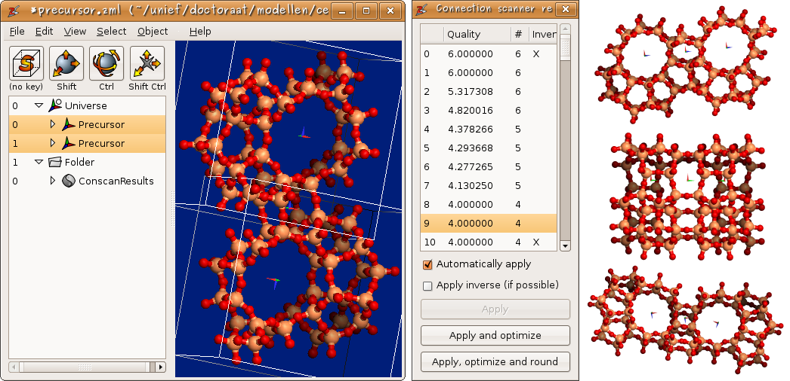

Zeobuilder Quick Tour
#####################

This page contains an (incomplete) illustrated overview of Zeobuilder's capabilities.

A slick user interface
======================

The user interface of Zeobuilder is kept minimalistic to encourage new users and
developers. As illustrated below, this straightforward design does not boycott
the implementation advanced and powerfull features.

.. figure:: images/zeobuilder_clean_compact.png
    :align: center

    Figure 1: The clean and concise user interface of Zeobuilder.

The user interface consists of four parts:

1. The big frame at the right contains the 3D visualization of the molecular model

2. The top of the window hosts the menu bar that offers many functions to
   manipulate/analyze the model.

3. Below the menu bar four interactive toolbar buttons are available and can be
   assigned to pre-programmed short-cuts. Depending on the
   `modifier keys <http://en.wikipedia.org/wiki/Modifier_key>`_ pressed while
   working with the mouse in the 3D view, (parts of) the model are selected,
   translated, rotated or the rotation center is translated.

4. The lower left part is a logical presentation of the model: It lists all
   items in the model in a hierarchical fashion.

The 3D view uses the OpenGL standard for rendering the model. Zeobuilder makes
extensive use of OpenGL display lists to unleash the full potential of 3D
hardware acceleration. Manipulations like rotations and translations, even for
thousands of atoms, are rendered fluently on screen.

User friendly
=============

* Any operation in Zeobuilder can be undone, redone or repeated if applicable.
  Humans make mistakes, so Zeobuilder offers the necessary tools to fix them.

   .. figure:: images/zeobuilder_user_friendly.png
       :align: center

       Figure 2: Basic features that make Zeobuilder user-friendly.

* Arbitrary parts of the model can be cut, copied, duplicated and pasted at new
  places in the model, or even in different instances of the Zeobuilder program.

* Most prominent menu functions are activated via a keyboard short-cut.

* Zeobuilder automatically detects which menu functions are applicable to the
  current selection, and only these menu functions are enabled.

* Selections in the 3D view and the logical view are always synchronized.
  Depending on your situation, the one is more practical than the other.

* Zeobuilder also has it's proper file format (.zml) in which all model
  information can be stored. Zeobuilder also accepts external file formats such
  as the `.xyz` and the `.pdb` formats, but in the `.zml` format is designed to
  store all information in a Zeobuilder model.

Configurable
============

* The interactive function buttons have no definite meaning. The user can
  associate different interactive functions with each combination of
  `modifier keys <http://en.wikipedia.org/wiki/Modifier_key>`_

   .. figure:: images/zeobuilder_interactive_functions.png
       :align: center

       Figure 3: One easily configures the interactive function associated with
       a given modifier key.

* Internally Zeobuilder represents all information in atomic units. This
  facilitates the programming of many features. When displaying certain measures
  in the user-interface, they are converted to the default units select in the
  configuration dialog. When the user enters new values, a different unit can be
  appended to that number, or if the unit is omitted, the default unit is
  assumed.

   .. figure:: images/zeobuilder_configurable2.png
       :align: center

       Figure 4: Users can select their favorite units.

* When a menu-bar function requires some parameters from the user (via a dialog
  box), Zeobuilder will remember the values which have been used as input during
  the last session of this menu function. These data are also stored in a
  configuration file, so Zeobuilder remembers them the next time you start the
  program.

* Some fields in the dialog boxes throughout Zeobuilder show an extra
  functionality when it comes to remembering previously used values. Zeobuilder
  records a history of the last 6 (or more) values. The user is free to save his
  favorite presets.

Advanced analysis
=================

* An elementary analysis of a molecular structure includes the measurement of
  various types of internal coordinates. The ''Interactive measurement tool''
  has been developed to make this task easy. Figure 3 shows how one selects the
  measurement tool. In figure 5, an example measurement is given on a zeolite
  structure. Zeobuilder does not only measure the conventional bond length,
  bending angle and dihedral angle, but also distances between points, lines and
  planes.

  .. figure:: images/zeobuilder_measurement.png
      :align: center

      Figure 5: An example measurement of internal coordinates.

* Instead of individual measurements, one can also make a statistical overview
  of the distribution of bond lengths, bending angles, ... An example for the
  Si-O-Si bending angle distribution in a zeolite cluster, is given in figure 6.

   .. figure:: images/zeobuilder_distribution.png
       :align: center

       Figure 6: An example of a statistical analysis of bending angles.

* Also a topological analysis is of interest in several fields, e.g. Zeobuilder
  can enumerate all ''strong rings'' in a molecular topology.

Powerful building tools
=======================

Auxiliary objects and related functionality
-------------------------------------------

A Zeobuilder model consists of much more than just atoms and bonds. In figure 7,
an example is displayed that contains three reference frames (each containing a
molecule), two spring objects that connect two molecules, a Lithium atom, and a
user-defined rotation axis.

.. figure:: images/zeobuilder_align.png
    :align: center

    Figure 7: The alignment of several molecules is facilitated by rotation
    axes and spring objects.

A few basic concepts are explained in the following items:

* The selected reference frames are surrounded by a wire-framed box.

* At the origin of each reference frame, the X, Y and Z axes are visualized in
  red, green and blue color respectively. This also applies to the global
  reference frame.

* The reference frames (and their contents) can be individually rotated and
  translated. Each transformation can be performed interactively in the 3D view,
  or numerically by entering the transformation parameters. In both cases, one
  can define assisting objects in the model, e.g. one can connect two atoms to
  define a rotation axis.

* Springs (with a predefined rest length) facilitate the alignment of molecules
  or molecular building blocks. Zeobuilder comes with a rigid body optimizer
  that tries to find the energy minimum for these springs as a function of the
  translation and rotation of the molecules.

The connection scanner for zeolite building blocks
--------------------------------------------------

Several zeolite-oriented tools in Zeobuilder, including the connection scanner,
use a geometrical abstraction of a condensation reaction. This is visualized in
figure 8. The hydrogen atoms are hidden to keep the figure transparent. (a) One
selects certain pairs of oxygen atoms that take part in the condensation
reaction. (b) The spring optimization or the connection scanner translate and
rotate one of the two molecules as to bring each pair of oxygen atoms into
overlap. (c) Each (overlapping) pair is replaced by a single oxygen atom at the
geometrical mean of the two original atoms.

.. figure:: images/condensation.png
    :align: center

    Figure 8: A schematic overview of the geometrical abstraction of a
    condensation reaction in Zeobuilder. See text for more details.

The connection scanner performs a deterministic search algorithm for all
possible ways to connect two zeolite clusters through a polycondensation
reaction. In order to limit the output to a manageable number of solutions, one
can parameterize the scanner with several limiting factors. First of all, the
connection scanner assumes that the two building blocks are rigid bodies.
Internally the scanner compares triangles formed by terminating oxygen atoms in
both structures. The minimum and maximum sizes of these triangles are important
limiting ingredients. One can also define the mismatch tolerance when comparing
triangles. A large mismatch tolerance will typically generate too many
solutions. Finally a quality cost-function is used to discriminate between
favorable and unrealistic solutions. The output is presented as in figure 9.

    Figure 9: The connection scanner: From left to right: (i) A screenshot of Zeobuilder after the connection scanner has analyzed the MFI precursor. (ii) The overview of the connection scanner results. (iii) Three examples of condensed pairs of MFI precursors generated with the connection scanner.

Developer friendly
==================

At first instance Zeobuilder will (hopefully) be very helpful in one's
day-to-day molecular editing tasks. After a while, one might however imagine
special features that are not implemented yet, but that would be very helpful.
In this perspective Zeobuilder is the number-one framework for the
implementation of dedicated features with a minimal effort. The reasons are
outline below.

Extensibility
-------------

Zeobuilder is designed to be extended with new features. The program consists of a small core and large amount of plugins. The core program has been kept as minimal as possible, while nearly all visible features of the program are implemented as plugins. These plugins do not interact with each other, so adding a new feature comes down to adding a new plugin. It is not necessary to interfere with the existing code base. Several types of plugins are supported:

* **nodes**: New types of objects that make up the molecular model.

* **actions**: New functionality, e.g. functions in the menu bar or interactive
  functions.

* **load_filters**: New file formats to read from.

* **dump_filters**: New file formats to write to.

* ...

There are a few other types of plugins that have more technical nature. It is
even possible create new categories of plugins via the plugin framework.

Python
------

Zeobuilder is written in `Python <http://www.python.org>`, an easy to learn
general-purpose language. Python rocks! It has given us the possibility to
create a lot of special features that would be far from trivial in any other
programming language. For example, plugins are self-contained python modules
(text files) that can be installed in your home-directory. Compilation is not
required and one can easily exchange plugins via email or web-pages.

Transferability
---------------

We do our best to implement each feature without making too much assumptions on
how this feature is going to be used. This sounds awkward, but consider the
spring optimization as a nice example. Initially the spring optimization was
only meant to be used for connecting zeolite clusters via the geometerical
abstraction of the condensation reaction. After a while we installed Zeobuilder
on a dedicated desktop machine available to everyone in our research group. It
turned out that the spring optimization was very popular for aligning organic
molecules. This was not planned, but the generic nature of the spring objects
resulted in unexpected applications.

Open Source
-----------

The whole Zeobuilder project only contains **Free Software**, distributed under
the conditions of the GNU General Public License version 3. This choice removes
all legal barriers for a collaborative development, while it still protects the
copyrights and the credits of all authors. See `GPL_License_v3
<http://www.gnu.org/licenses/gpl-3.0.html>`_ for technical details.

