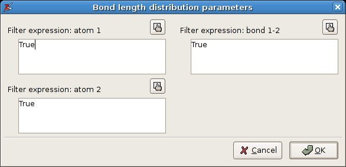

Measurements
############

The Interactive measurement tool
================================

The interactive measurement tool is well-suited for computing all types of
internal coordinates in a molecule. It is activated as follows: Click on one of
the tool bar buttons and select the ``Measurement tool`` from the popup menu.
This is shown in the figure below.

.. figure:: images/zeobuilder_measurement_tool_button.png
    :align: center

    How to select another interactive tool.
    The inset shows the button after the new interactive tool is selected.

In this figure, the measurement tool is associated with mouse operations in the 3D view while no
`modifier keys <http://en.wikipedia.org/wiki/Modifier_key>`_ are pressed on the
keyboard. That is what '``(no key)``' stands for. Now just click on a few atoms in
the 3D view. They will be enumerated and connected by line segments. A tool
window will also pop up. It lists all possible internal coordinates related to
the enumerated atoms. The measurement tool follows a few rules for enumerating
atoms:

* At most four atoms are enumerated. When more than four atoms are clicked, the
  last ones in the queue are discarded.

* When a bond is clicked, both atoms connected by this bond are added.

* When clicking in the background, the queue is reset.

* When clicking anywhere with the right button, the newest point is removed from
  the queue. (One can repeat this until no points are left.)

* Instead of atoms, any point-like object can be used: points, spheres, boxes,
  reference frames, ...

* Instead of bonds, any vector-like object can be used: arrows and springs.

* There are four types of queues: pairs, triples, triangles and quadruples. The
  list of internal coordinates depends on the queue type. They are all shown in
  figure A4.2

When done with the measurements, click on the toolbar button that displays the
measurement icon, and select the ``Selection picker``. Download the model
:download:`glucose_phosphate.zml <examples/glucose_phosphate.zml>` to experiment
with the measurement tool.

.. figure:: images/zeobuilder_measurement_types.png
    :align: center

    The four different measurement types: (a) the pair, (b) the triple, (c) the triangle and (d) the quadruple.

Chemical formula
================

For large systems, it is sometimes handy to query the chemical formula of the
current selection. This menu function is located at ``Object -> Molecular ->
Chemical Formula``. For the glucose phosphate molecule, the
chemical formula is displayed as follows:

.. figure:: images/zeobuilder_chemical_formula.png
    :align: center

    The chemical formula function.

Statistical analysis of internal coordinates
============================================

In addition to the single measurements of the first section, Zeobuilder is also
capable of making elementary statistical studies of a molecular geometry. There
are three (similar) analysis functions: ``Object -> Molecular -> Distribution of
bond lengths``, ``Object -> Molecular -> Distribution of bending angles`` and
``Object -> Molecular -> Distribution of dihedral angles``. We will demonstrate
this feature by making a few distributions of bond lengths in a zeolite cluster
geometry. This geometry is a snapshot from a molecular dynamics run. Open this
file in Zeobuilder: :download:`precursor.zml <examples/precursor.zml>`

All bond lengths
----------------

As a first example, we will make a statistical analysis of all the bond lengths:

 1. Select the global reference frame.
 2. Activate ``Object -> Molecular -> Distribution of bond lengths``.

A Popup dialog shows up, asking for a few filter parameters. Fill in the values
given in figure below. Setting all filters to `True` means that all bonds will be
processed.

    The filter dialog for the statistical analysis of the bond lengths.

The resulting analysis is shown in the following figure. The width of the
histogram bins is chosen automatically. The save button asks for a filename
prefix. It saves the figure as a png bitmap and an svg vector drawing, and the
list of bond lengths is written to a text file.

.. figure:: images/zeobuilder_all_bonds_analysis.png
    :align: center

    The statistical analysis of all bond lengths.

All Si-O bond lengths
---------------------

The filters can be used to limit the analysis to a subset of bonds. As an
example, we will repeat the analysis with the following filters:

 * **atom 1:** ``atom.number == 14``

 * **atom 2:** ``atom.number == 8``

 * **bond 1-2:** ``True``

Zeobuilder will consider all bonds in (the selected part of) the model. For each
bond the filter expressions are evaluated. The first two expressions are applied
to the atoms connected by a bond, and the last expressions is applied to the
bond object itself. Only when all expressions evaluate to True, the bond is
included in the analysis. The filter expressions are in fact boolean
`Python <http://www.pythonn.org>`_ expressions. The result is given in the
following figure:

.. figure:: images/zeobuilder_si_o_bonds_analysis.png
    :align: center
    
    The statistical analysis of all Si-O bond lengths.

.. note::

    Zeobuilder is clever enough to apply the filters in the following sense::

        ((filter_atom1(atom_a) and filter_atom2(atom_b)) or (filter_atom2(atom_a) and filter_atom1(atom_b)) and filter_bond12(bond_ab)

    for each pair of bonded atoms atom_a and atom_b. The code will not accidentally overlook a bond.

All Si-O bonds, where the oxygen is part of an hydroxyl group
-------------------------------------------------------------

The filter expressions can be made very complex. Try this:

 * **atom 1:** ``atom.number == 14``

 * **atom 2:** ``atom.number == 8 and reduce(lambda x,y: x or y, (neighbor.number == 1 for neighbor in atom.yield_neighbors()), False)``

 * **bond 1-2:** ``True``

The resulting distribution is shown in the next figure:

.. figure:: images/zeobuilder_si_o_hydr_bonds_analysis.png
    :align: center

    The statistical analysis of all Si-O bond lengths, where the oxygen is part of an hydroxyl group.

.. warning::
    
    The `API <http://en.wikipedia.org/wiki/API>`_ of the filter expressions is
    not settled yet, nor is it extensively documented. There is no guarantee
    that these example will work in all future versions of Zeobuilder.

